# Tank Chess: Fun Set Plus — правила дополнения

Перевод официального рулбука дополнения (`RuleBook_Extended_v2.pdf`, 4 страницы
текста + 4 страницы схем). Иллюстрации вырезаны из исходного PDF и лежат в
[img-plus/](img-plus/).

Базовые правила — [rulebook.md](rulebook.md), дополнение Fun Set —
[rulebook-fun-set.md](rulebook-fun-set.md).

- [Состав дополнения](#состав-дополнения)
- [Препятствия](#препятствия)
- [Новые фигуры](#новые-фигуры)
  - [Боевые машины](#боевые-машины)
  - [Особые фигуры](#особые-фигуры)
  - [Лодки](#лодки)
- [Расстановки доски](#расстановки-доски)
- [Сводка новых машин](#сводка-новых-машин)
- [Кто где не проходит](#кто-где-не-проходит)

---

В базовой игре Tank Chess пять типов танков и две доски (16×16 и 20×20 клеток),
которые можно менять бесчисленными способами с помощью сборных препятствий. Это
уже гарантирует разнообразие и долгий интерес, но тем, кто любит новые вызовы,
предназначены дополнения, приносящие много новых элементов.

Дополнение **Fun Set Plus** добавляет восемь новых типов препятствий и 15 новых
типов фигур, но суть игры не меняется: обыграть противника, аккуратно маневрируя
своими фигурами.

## Состав дополнения

- 8 типов препятствий: 12 низких препятствий (белые), 32 водных (полупрозрачные
  синие), 12 живых изгородей (полупрозрачные зелёные), 12 огненных
  (полупрозрачные красные), 20 ледяных (матово-белые), 10 дорог (полупрозрачные
  чёрные), 12 дымовых (круглые серые маркеры) и 10 наземных мин (красные
  шестиугольные маркеры)
- 15 типов фигур (всего 40 фигур)
- 4 круглых красных маркера (для обозначения уничтоженных ДОТов)
- Два справочных листа с характеристиками танков
- 30 информационных карточек
- Две памятки по препятствиям
- Рулбук и брошюра

---

## Препятствия

В базовом наборе есть только **высокие препятствия** (тёмно-коричневые),
изображающие здания, валуны и подобные объекты, через которые танки не могут ни
проехать, ни выстрелить. Fun Set Plus добавляет восемь типов препятствий,
по-разному влияющих на движение и стрельбу.

### Низкие препятствия

**Низкие препятствия** изображают низкие стены, камни и тому подобное — проехать
через них танки не могут. Стрелять поверх них могут все типы танков (кроме
танкетки — у неё низкий силуэт). Однако **ни один** тип танка не может стрелять
поверх низкого препятствия, если у самой цели низкий силуэт — это танкетка (TK) и
радиоуправляемая бомба (RB). На миномёты и гаубицы это не распространяется: они
поражают любую цель поверх любого препятствия.

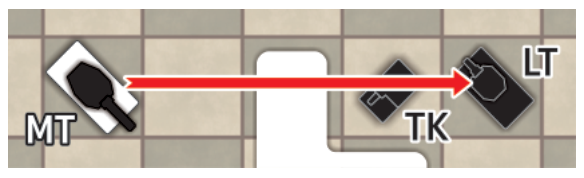

На схеме выше белый средний танк не может стрелять по чёрной танкетке, стоящей за
низким препятствием, но может выстрелить **поверх танкетки** и уничтожить чёрный
лёгкий танк.

### Вода

**Водные препятствия** изображают широкие водные поверхности (реки, озёра и
прочее). Свободно перемещаться по воде могут несколько типов фигур из этого
дополнения: быстроходный катер (FB), артиллерийский катер (GB), лёгкая (LL) и
тяжёлая (HL) десантные баржи и амфибийная гаубица (AH).

Вода никак не мешает стрельбе. Когда машина, находящаяся на воде, уничтожена,
фигура снимается с доски (она тонет). При желании игрок может умышленно завести
любой свой танк в воду и утопить его (фигура снимается с доски) — например, чтобы
открыть проход другой фигуре.

У части широких полупрозрачных синих препятствий вырезаны фигурные проёмы,
изображающие **плоские острова**. По этим островам могут двигаться наземные машины
(если их туда доставили десантные баржи) и амфибийные машины:

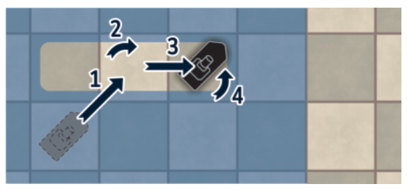

Высокие и низкие препятствия можно ставить **поверх** водных: они действуют так
же, как на земле (проехать нельзя, высокие перекрывают стрельбу и так далее).

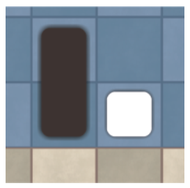

### Живые изгороди

**Живые изгороди** (изображают высокие кусты и чащу) обладают свойствами,
противоположными низким препятствиям. Проехать сквозь изгородь могут все машины,
но **стрелять сквозь неё не может никто**: она перекрывает обзор, если стоит хотя
бы на одной из клеток между стрелком и целью. Однако миномёты и гаубицы стреляют
поверх изгородей как обычно. Проезд танка изгородь не уничтожает (после его
отъезда она распрямляется).

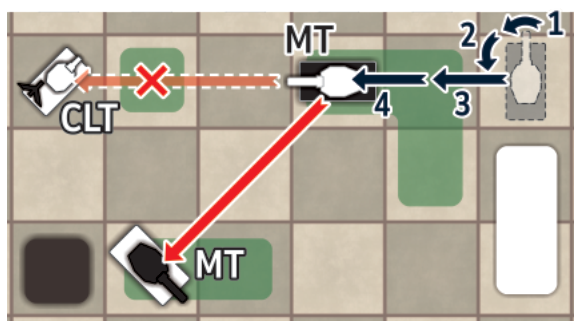

На схеме выше чёрный средний танк может стрелять по белому MT (изгородь примята
фигурой, стоящей на той же клетке, и потому стрельбе не мешает), но не может — по
белому CLT, потому что на линии огня стоит изгородь.

### Огонь

**Огненные препятствия** изображают горящие изгороди. Поджечь изгородь может
только огнемёт (FT). Когда FT «стреляет» по любой клетке с изгородью
(полупрозрачная зелёная), горит **вся** изгородь целиком: полупрозрачная зелёная
фигура заменяется красной. Соседние изгороди (отдельные пластиковые фигуры) при
этом не загораются.

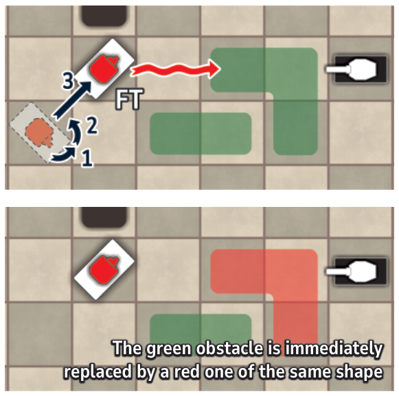

Загоревшись (то есть став огненным препятствием), красная фигура остаётся на доске
**до конца партии**.

В некоторых расстановках («Fiery Battlefield») огненные препятствия выставлены
с самого начала.

Как и изгороди, огонь перекрывает линию видимости, и стрелять сквозь него нельзя
(только миномёты и гаубицы бьют поверх него).

Большинство машин может проезжать по клеткам с огнём, но как только машина въехала
в огонь, она обязана **немедленно выехать следующим шагом того же хода** (нельзя
проходить через огонь по двум клеткам подряд и нельзя поворачиваться на месте,
стоя в огне).

Если танк заканчивает движение в огне или не выезжает немедленно, он **уничтожается
и остаётся на месте** (стрелять в этот ход он уже не может).

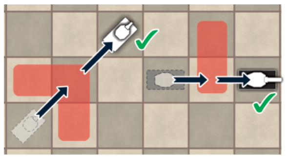

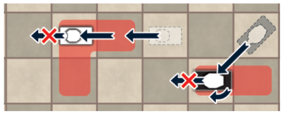

По разным причинам (колёса с шинами, открытая рубка, малая скорость) часть машин
**вообще не может** проходить через огонь: въехав на клетку с огнём, такая машина
немедленно уничтожается на этой клетке. Это: разведывательный танк — **RT**,
лёгкий миномёт — **LM**, ракетная установка — **RL** и истребитель — **TH** (из
дополнения Fun Set); противотанковое отделение — **AS**, минный заградитель — **ML**
и радиоуправляемая бомба — **RB** (из этого дополнения); десантное подразделение —
**AU** (из дополнения Airborne); бронеавтомобиль — **AC**, вооружённый внедорожник
— **AO** и ультратяжёлый танк — **UT** (из мини-дополнения Special Pieces).

Иногда игрок может умышленно завести фигуру на клетку с огнём и тем самым
самоуничтожиться (например, чтобы заблокировать проход).

### Лёд

**Ледяные препятствия** ставятся поверх водных и изображают замёрзшую поверхность.
Каждое ледяное препятствие занимает одну клетку доски.

По льду могут двигаться следующие машины (легковесная категория): лёгкий танк —
**LT** (из базовой игры); разведывательный танк — **RT**, истребитель — **TH**,
амфибия — **AM**, лёгкий миномёт — **LM** и лёгкая гаубица — **LH** (из Fun Set);
танкетка — **TK**, радиоуправляемая бомба — **RB**, противотанковое отделение —
**AS**, минный заградитель — **ML** и амфибийная гаубица — **AH** (из Fun Set
Plus); десантный лёгкий танк — **AL**, десантное подразделение — **AU** и быстрая
зенитная машина — **FA** (из Airborne); вооружённый внедорожник — **AO**,
бронеавтомобиль — **AC** и лёгкий истребитель — **LD** (из Special Pieces).

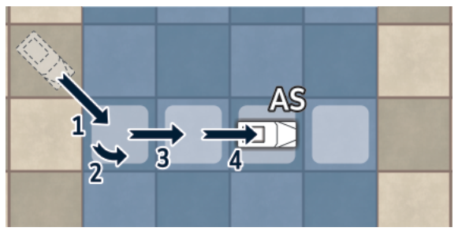

Если на клетку со льдом заезжает более тяжёлая машина, лёд ломается, и машина тонет
(фигура и ледяной маркер снимаются с доски).

Лодки не могут проходить через клетки, покрытые льдом: быстроходный катер — **FB**,
артиллерийский катер — **GB**, лёгкая — **LL** и тяжёлая — **HL** десантные баржи
(и бронекатер — **AB** из Special Pieces).

Стрельбе лёд не мешает.

Лёд можно растопить огнемётом: когда FT «стреляет» по клетке со льдом, ледяной
маркер снимается с доски:

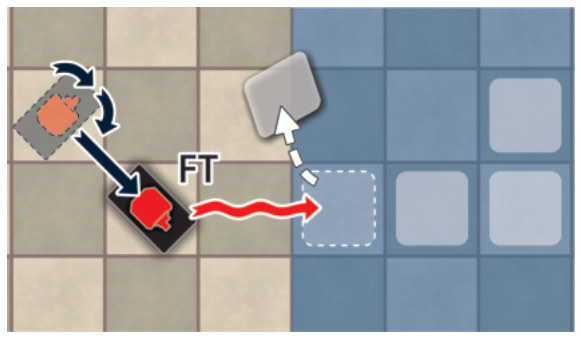

Если машина стоит на льду и уничтожена огнемётом, лёд под ней растаивает, и
уничтоженная фигура снимается с доски (тонет).

### Дым

**Дымовые препятствия** при расстановке на доску не ставятся — их создают дымовые
пусковые установки (SL) прямо в игре. При выстреле дымовой шашкой на доску
кладётся серый картонный маркер, занимающий одну клетку.

Движению машин дым никак не мешает, но **стрелять через эту клетку нельзя** —
он перекрывает линию видимости (как изгородь). Исключение — стрельба миномёта или
гаубицы.

Когда любая машина приходит на клетку с дымом или проходит через неё, маркер
снимается с доски (дым рассеивается).

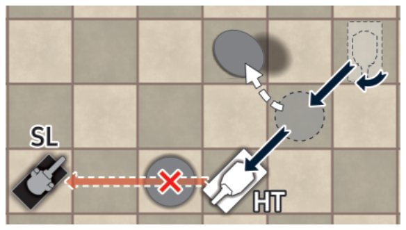

На схеме выше белый тяжёлый танк проходит через клетку с дымовым маркером (и тем
снимает его с доски). После перемещения HT не может стрелять по чёрной дымовой
установке, потому что на линии огня стоит другое дымовое препятствие.

### Дороги

**Дорога** изображает твёрдое покрытие, по которому танки едут быстрее. Любая
машина получает **один дополнительный шаг**, если все клетки, которые она проходит
в этом ходу, включая начальную и конечную, лежат на дороге.

На стрельбу дорога никак не влияет.

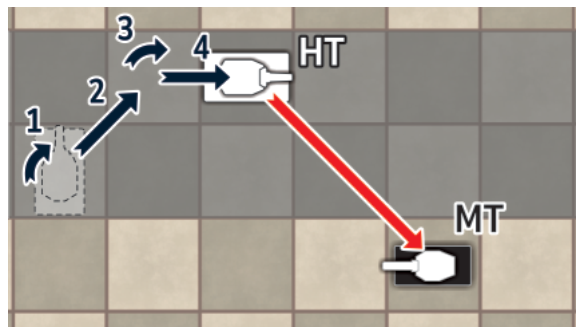

На схеме выше белый тяжёлый танк прошёл 4 шага, хотя его скорость 3.

### Наземные мины

**Наземные мины** обозначены красными шестиугольными маркерами (см. также
[Fun Set](rulebook-fun-set.md#наземные-мины)). В этом дополнении их выставляет на
доску минный заградитель (ML).

---

## Новые фигуры

В дополнении 15 типов фигур. У большинства есть особые свойства и способности; все
они напечатаны на справочных листах и информационных карточках.

Ниже характеристики записаны как в оригинале: **броня — лоб–борт–корма**.

### Боевые машины

**Тяжёлый истребитель** (Heavy Destroyer, HD) — та же скорость, что у тяжёлого
танка (**3**), очень крепкая броня (**III**–**III**–**I**) и мощная пушка (**V**).
Стреляет только прямо вперёд (вращающейся башни нет). Особой способности у него
нет, но роль в игре может быть весомой — за счёт пушки.

**Пехотный танк** (Infantry Tank, IT) — приличная скорость (**4**) и слабая пушка
(**I**), зато броня **одинаково хороша со всех сторон** (**II**–**II**–**II**).
Любопытно, что пехотный танк не может уничтожить другой такой же, потому что у
того нет слабой стороны.

**Танкетка** (Tankette, TK) — низкий силуэт, поэтому она не может стрелять поверх
низкого препятствия, но может **укрыться** за ним от огня противника. Уничтоженная
танкетка кладётся **на спину** (а не на бок). И живая, и уничтоженная танкетка
обладает свойствами низкого препятствия: все фигуры могут стрелять поверх неё.
Скорость приличная (**4**), броня слабая (**I**–**0**–**0**), пушка слабая
(**I**) и стреляет только прямо вперёд (башни нет).

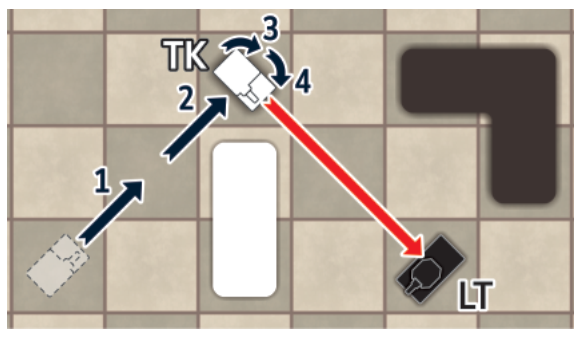

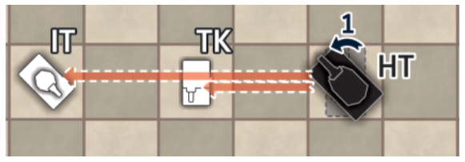

На схеме выше чёрный тяжёлый танк может стрелять и по пехотному танку, и по
танкетке (но игрок обязан выбрать только одну цель).

**Огнемёт** (Flamethrower, FT) — скорость (**3**) и броня (**III**–**II**–**I**)
как у тяжёлого танка. Вместо обычной пушки у него огнемёт. Дальность оружия очень
мала — ровно **2** клетки (на дистанции 1 применить нельзя), зато мощность
**абсолютна**: он уничтожает любую цель, включая ДОТы. Башня есть, поэтому
стреляет в трёх направлениях. Он же поджигает изгороди и растапливает лёд (см.
выше).

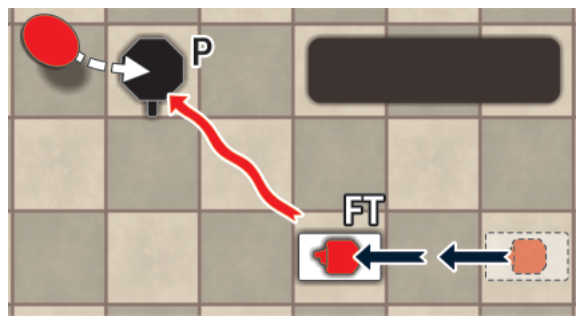

На схеме выше белый FT уничтожает чёрный ДОТ. На уничтоженный ДОТ кладётся красный
маркер.

**Быстроходный катер, артиллерийский катер, амфибийная гаубица** — см.
[Лодки](#лодки).

### Особые фигуры

**ДОТ** (Pillbox, P) можно считать неподвижной фигурой или своего рода активным
препятствием, которое стреляет по танкам противника.

Пушка ДОТа имеет значение **IV** и стреляет в трёх направлениях. В отличие от
танков, ДОТ может стрелять по фигурам, стоящим на **непосредственно соседних**
клетках. Если машина противника заканчивает движение на линии огня, игрок,
которому принадлежит ДОТ, может выстрелить из него — но **не может двигать ни одну
фигуру в этот ход**.

У ДОТа очень крепкая бетонная броня со всех сторон (**V**), поэтому уничтожить его
не может ни один танк — кроме огнемёта (который броню не пробивает, а выжигает
цель).

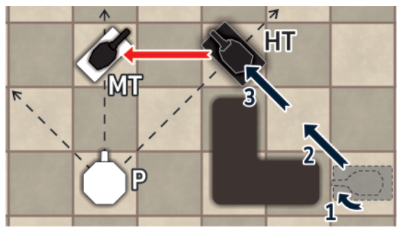

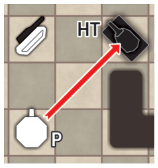

На левой схеме чёрные пунктирные стрелки показывают направления огня ДОТа. Чёрный
HT уничтожает белый MT, а следующим ходом (правая схема) белый игрок решает
воспользоваться возможностью и уничтожает чёрный HT.

**Дымовая установка** (Smoke Launcher, SL) — скорость (**4**) и пушка (**II**) как
у среднего танка, но броня чуть слабее (**II**–**0**–**0**). Башня есть, стреляет
в трёх направлениях.

Особая способность — пуск дымовых шашек. Пускать можно в трёх направлениях, на
дистанцию 1, 2 или 3 клетки. Шашка перелетает через любое препятствие или машину
(как огонь гаубицы/миномёта). Выставленный дым обозначается круглым серым маркером.

Дымовую шашку **нельзя** запустить на клетку, занятую фигурой, высоким
препятствием, водой, изгородью, деревом или огнём.

За один ход дымовая установка либо стреляет из пушки, либо пускает шашку — **не то
и другое**. Число пусков за партию не ограничено.

Стрелять сквозь дым нельзя. Когда любая машина проходит через дым, серый маркер
снимается с доски.

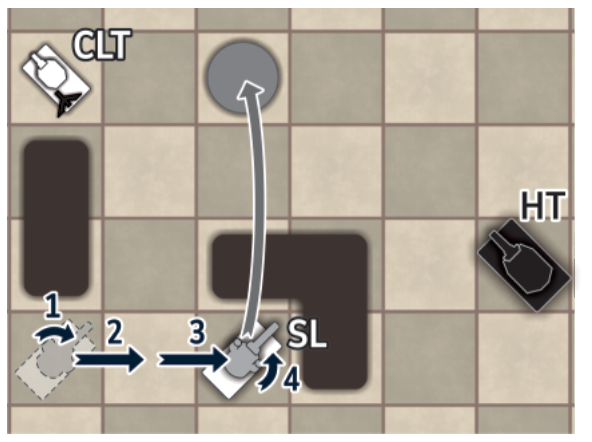

На схеме выше белая дымовая установка прикрыла белый командирский танк (CLT),
запустив дымовую шашку и создав завесу.

**Радиоуправляемая бомба** (Remote-controlled Bomb, RB) — очень специфическая
фигура. Хорошая скорость (**5**), но брони нет вовсе (**0**–**0**–**0**). Её
оружие — заряд, который можно активировать **только один раз**, после чего сама RB
уничтожается. Мощность взрыва **V**, поэтому он уничтожает любой тип фигуры, кроме
ДОТа. При активации уничтожаются (кладутся на бок) **все фигуры на соседних
клетках**, включая свои, если они там оказались. После взрыва фигура RB снимается с
доски (она полностью разрушена и препятствием в дальнейшей игре не является).

RB взрывается, если по ней выстрелит любая фигура любой из сторон. Если RB попадает
в огонь, она взрывается немедленно (как только въезжает на клетку с огнём). Эффект
точно такой же: фигура RB снимается с доски, а все фигуры на соседних клетках
уничтожаются (кладутся на бок).

Как и у танкетки, у RB низкий профиль, поэтому она может укрыться за низкими
препятствиями, а все фигуры (кроме танкетки) могут стрелять поверх неё.

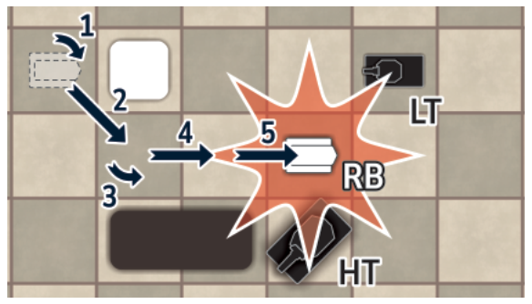

На схеме выше белая RB активируется и уничтожает две фигуры противника (HT и LT).

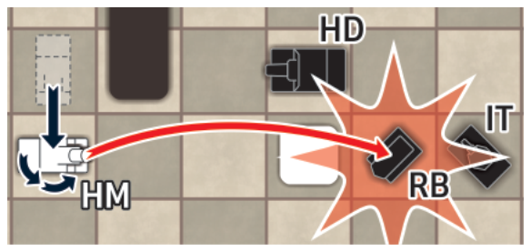

На схеме выше белый тяжёлый миномёт выстрелил по чёрной RB, и взрыв уничтожил ещё
две чёрные фигуры (HD и IT).

**Противотанковое отделение** (Anti-tank Squad, AS) — полугусеничная машина со
скоростью **4** и без брони (**0**–**0**–**0**). Её оружие — солдаты, которые
выходят из машины и закладывают заряд (мощность **III**) на танк противника. Чтобы
уничтожить машину противника, AS должно прийти на **соседнюю клетку**, со стороны,
где у цели значение брони **II или меньше** (ориентация самого AS не важна —
солдаты могут выйти с любой стороны).

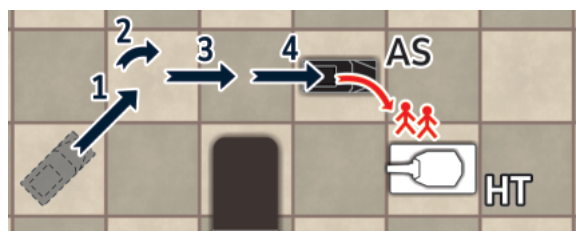

**Минный заградитель** (Minelayer, ML) — грузовик с высокой скоростью (**6**) и без
брони (**0**–**0**–**0**).

Двигается ML как остальные машины, но **не может поворачиваться на 45° дважды
подряд на одной клетке**: между поворотами он обязан либо сделать хотя бы один шаг
прямо вперёд, либо дождаться следующего хода, чтобы повернуть, оставаясь на той же
клетке.

Активного оружия у ML нет, зато он несёт наземные мины и выставляет их на доску.
Мина (красный шестиугольный маркер) кладётся на клетку **непосредственно позади**
заградителя, после его перемещения.

Выставленные мины остаются на доске и полезны для запирания узких проходов. Любая
фигура (кроме MS) немедленно уничтожается, придя на клетку с миной (как правило,
делать это незачем, но иногда уничтоженная фигура служит прикрытием для других).
Стрельбе мины никак не мешают.

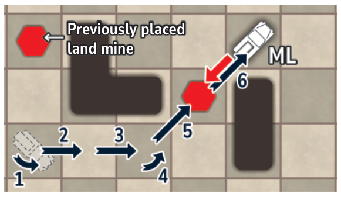

**Минный тральщик** (Minesweeper, MS) — средний танк с минным трал-бойком,
уничтожающим наземные мины простым проездом по ним. Маркеры снятых мин убираются с
доски. За один ход MS может протралить сразу несколько клеток с минами. Скорость
(**4**) и пушка (**II**) как у среднего танка, но бортовая броня слабее
(**II**–**0**–**0**) — плата за вес трала.

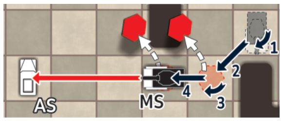

На схеме выше чёрный MS обезвредил за один ход две мины и стреляет по белому AS.

### Лодки

**Амфибийная гаубица** (Amphibious Howitzer, AH) двигается и по земле, и по воде,
скорость **4**. Брони нет (**0**–**0**–**0**), огневая мощь гаубицы (стреляет
поверх препятствий) — **III**. Стреляет только прямо, на дистанции от **3** до
**6** клеток.

**Быстроходный катер** (Fast Boat, FB) может двигаться **только по воде**.
Равноценен лёгкому танку: скорость **5**, броня **I**–**0**–**0**, пушка **I** в
башне (стреляет в трёх направлениях).

**Артиллерийский катер** (Gun Boat, GB) равноценен среднему танку: скорость **4**,
броня **II**–**I**–**0**, пушка **II** в башне.

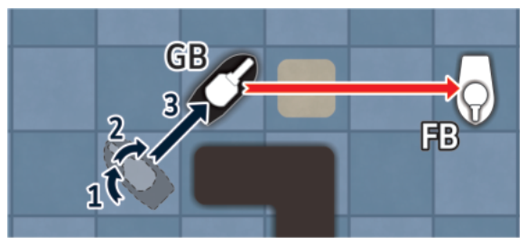

На схеме выше чёрный GB уничтожает белый FB. Поражённая лодка снимается с доски
(тонет).

**Лёгкая десантная баржа** (Light Landing Boat, LL) служит для переправы наземных
машин через воду. Скорость **4**, броня **0**–**I**–**0**, вооружения нет.

На LL можно погрузить все наземные машины (включая амфибийные), кроме более
тяжёлых: тяжёлый танк — **HT** (базовая игра); сверхтяжёлый танк — **ST** и тяжёлый
бульдозер — **HB** (Fun Set); огнемёт — **FT** и тяжёлый истребитель — **HD** (Fun
Set Plus); ультратяжёлый танк — **UT** (Special Pieces).

Машина может въезжать на баржу и покидать её и с носа, и с кормы, но только **по
прямой**.

Когда баржа идёт, погруженная на неё машина может стрелять, но **только прямо
вперёд** — даже если у неё есть башня.

При стрельбе по барже с машиной на борту в расчёт берётся броня **самой баржи**
(**0**–**I**–**0**).

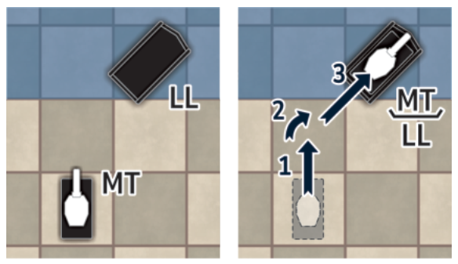

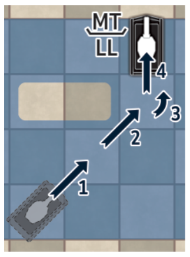

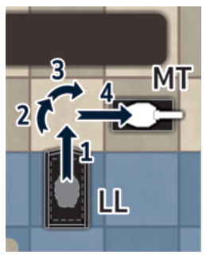

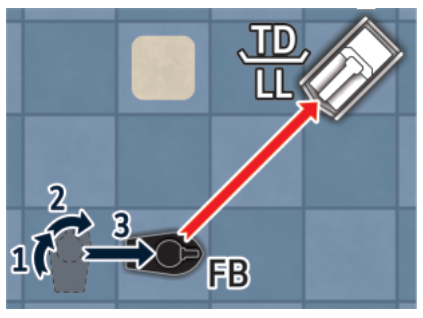

**Тяжёлая десантная баржа** (Heavy Landing Boat, HL) везёт **все** машины, кроме
сверхтяжёлого танка (Fun Set) и ультратяжёлого танка (Special Pieces). Скорость
**3**, броня **0**–**II**–**0**.

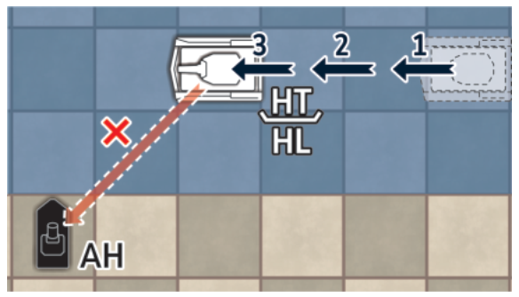

На схеме выше белый HT, погруженный на HL, не может стрелять по AH с этой позиции,
потому что на десантной барже танки стреляют только прямо вперёд.

Пустая десантная баржа (LL или HL) считается **низким препятствием** в направлении
нос–корма: танки могут стрелять поверх неё.

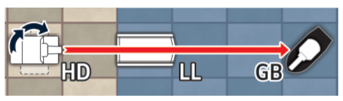

---

## Расстановки доски

В брошюре приведены три варианта одной расстановки (для досок 16×16, 20×20 и 24×24
клеток) — они показаны на схемах ниже. Всего брошюра содержит ещё 10 расстановок,
каждая в трёх или четырёх вариантах (у части есть и вариант для доски 12×12).

Кроме препятствий и фигур из базовой игры и этого дополнения, часть расстановок
использует элементы дополнения Fun Set. Расстановки для доски 24×24 используют
элементы, входящие в расширенное издание Tank Chess (Extended edition).

### Fiery Battlefield («Огненное поле»)

Эта расстановка отличается **большим числом огненных препятствий**, стоящих на
доске с самого начала партии.

Роль командирского танка отдана противотанковому отделению (**CAS**). AS — одна из
машин, которые не могут проходить по клеткам с огнём, поэтому найти маршрут на
противоположную сторону доски для мата побегом здесь совсем не просто.

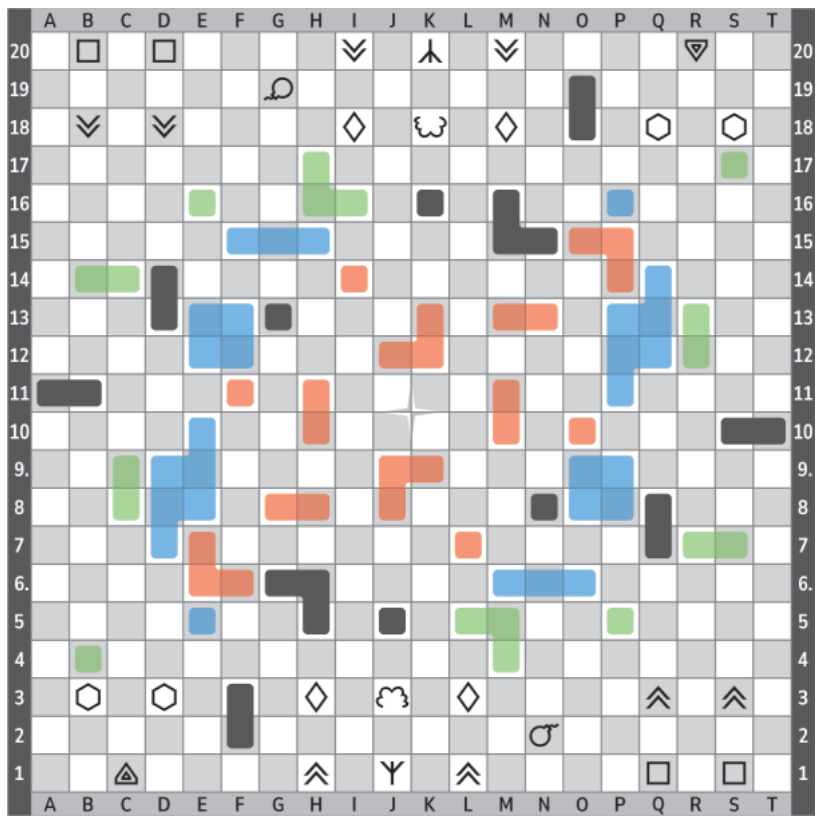

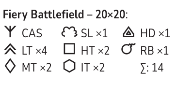

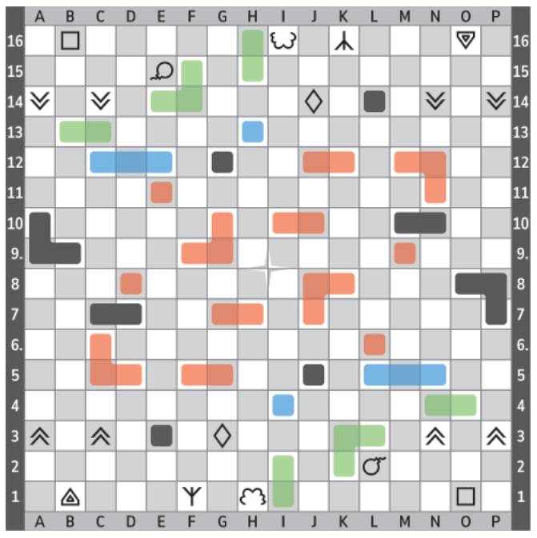

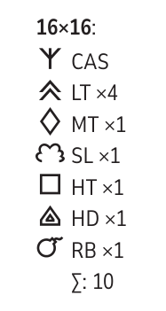

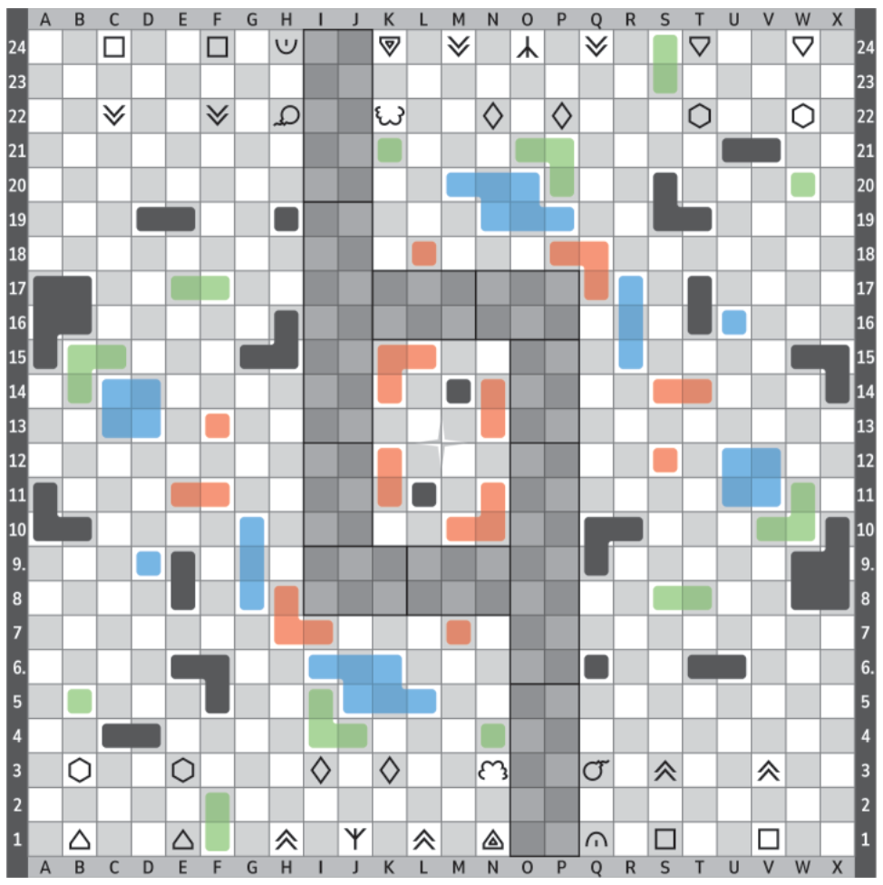

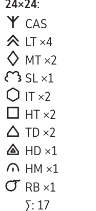

Состав фигур на сторону (из списков на схемах):

| Доска | Фигуры | Всего |
|---|---|---|
| 16×16 | CAS, LT ×4, MT ×1, SL ×1, HT ×1, HD ×1, RB ×1 | 10 |
| 20×20 | CAS, LT ×4, MT ×2, SL ×1, HT ×2, IT ×2, HD ×1, RB ×1 | 14 |
| 24×24 | CAS, LT ×4, MT ×2, SL ×1, IT ×2, HT ×2, TD ×2, HD ×1, HM ×1, RB ×1 | 17 |

---

## Сводка новых машин

Значения собраны из текста рулбука; броня записана как **лоб–борт–корма**. Прочерк
означает, что характеристика в тексте не названа или у фигуры отсутствует.

| Машина | Код | Скорость | Огневая мощь | Броня | Особенности |
|---|---|---|---|---|---|
| Тяжёлый истребитель | HD | 3 | V | III–III–I | без башни, огонь только вперёд |
| Пехотный танк | IT | 4 | I | II–II–II | нет слабой стороны; не берёт такой же IT |
| Танкетка | TK | 4 | I | I–0–0 | низкий силуэт; сама как низкое препятствие |
| Огнемёт | FT | 3 | абсолютная | III–II–I | дальность ровно 2; жжёт ДОТы, поджигает изгороди, топит лёд |
| ДОТ | P | 0 (неподвижен) | IV | V со всех сторон | бьёт и в упор; стрельба вместо хода фигурой |
| Дымовая установка | SL | 4 | II | II–0–0 | дымовая шашка на 1–3 клетки вместо выстрела |
| Радиоуправляемая бомба | RB | 5 | V (однократно) | 0–0–0 | взрыв по всем соседним клеткам; низкий профиль |
| Противотанковое отделение | AS | 4 | III (заряд) | 0–0–0 | бьёт только с соседней клетки в борт брони ≤ II |
| Минный заградитель | ML | 6 | — | 0–0–0 | выставляет мину позади себя; нельзя два поворота подряд |
| Минный тральщик | MS | 4 | II | II–0–0 | снимает мины проездом |
| Амфибийная гаубица | AH | 4 | III | 0–0–0 | земля и вода; навесом 3–6 клеток, только вперёд |
| Быстроходный катер | FB | 5 | I | I–0–0 | только по воде; башня |
| Артиллерийский катер | GB | 4 | II | II–I–0 | только по воде; башня |
| Лёгкая десантная баржа | LL | 4 | — | 0–I–0 | везёт лёгкие наземные машины |
| Тяжёлая десантная баржа | HL | 3 | — | 0–II–0 | везёт всё, кроме ST и UT |

Минный тральщик (MS) совпадает с [версией из Fun Set](rulebook-fun-set.md#машины-особых-ролей).

---

## Кто где не проходит

Три списка исключений разбросаны по рулбуку; здесь они собраны вместе. Коды
дополнений: *FS* — Fun Set, *FSP* — Fun Set Plus, *AB* — Airborne, *SP* — Special
Pieces.

**Гибнут в огне сразу** (не могут проходить через огонь вовсе): RT, LM, RL, TH
(FS); AS, ML, RB (FSP); AU (AB); AC, AO, UT (SP).

**Проходят по льду** (легковесная категория): LT (базовая); RT, TH, AM, LM, LH
(FS); TK, RB, AS, ML, AH (FSP); AL, AU, FA (AB); AO, AC, LD (SP). Лодки (FB, GB,
LL, HL, а также AB из SP) сквозь лёд пройти не могут.

**Не грузятся на лёгкую баржу (LL)**: HT (базовая); ST, HB (FS); FT, HD (FSP); UT
(SP). **Не грузятся на тяжёлую баржу (HL)**: ST (FS) и UT (SP).
