# Tank Chess: Fun Set — правила дополнения

Перевод официального рулбука дополнения (`RuleBook_Extended.pdf`, 4 страницы).
Иллюстрации вырезаны из исходного PDF и лежат в [img-ext/](img-ext/). Базовые
правила — в [rulebook.md](rulebook.md), дополнение Fun Set Plus — в
[rulebook-fun-set-plus.md](rulebook-fun-set-plus.md).

- [Состав дополнения](#состав-дополнения)
- [Препятствия](#препятствия)
- [Новые фигуры](#новые-фигуры)
  - [Боевые машины](#боевые-машины)
  - [Машины навесного огня](#машины-навесного-огня)
  - [Машины особых ролей](#машины-особых-ролей)
- [Радиоуправляемые мины](#радиоуправляемые-мины)
- [Расстановки доски](#расстановки-доски)
- [Сводка новых машин](#сводка-новых-машин)

---

В базовой игре Tank Chess пять типов танков и две доски (16×16 и 20×20 клеток),
которые можно менять бесчисленными способами с помощью сборных препятствий. Это
уже гарантирует разнообразие и долгий интерес, но тем, кто хочет пройти лишнюю
милю, предназначено дополнение **Fun Set**, приносящее много новых элементов.

Появляются новые препятствия и типы танков, но суть игры не меняется: обыграть
противника, аккуратно маневрируя своими фигурами.

## Состав дополнения

- 6 типов препятствий: 6 низких препятствий (белые), 16 водных (полупрозрачные
  синие), 12 живых изгородей (полупрозрачные зелёные), 12 грязевых
  (полупрозрачные жёлтые), 20 деревьев (зелёные маркеры) и 10 наземных мин
  (красные маркеры)
- 14 типов танков (всего 44 фигуры)
- Два блокнота для записи координат радиоуправляемых мин
- Два справочных листа с характеристиками танков
- 28 информационных карточек
- Две памятки по препятствиям
- Рулбук и брошюра

---

## Препятствия

В базовом наборе есть только **высокие препятствия** (тёмно-коричневые),
изображающие здания, валуны и подобные объекты, через которые танки не могут ни
проехать, ни выстрелить. Дополнение Fun Set добавляет шесть разных типов
препятствий, по-разному влияющих на движение и стрельбу.

### Низкие препятствия

**Низкие препятствия** изображают низкие стены, камни и тому подобное — проехать
через них танки не могут. Но из-за малой высоты **стрелять поверх них могут все
типы танков**.

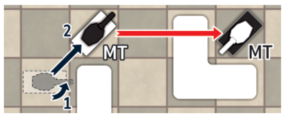

На схеме выше белый средний танк объехал низкое препятствие и выстрелил по
чёрному MT поверх другого низкого препятствия.

### Вода

**Водные препятствия** (изображают реки, озёра, каналы и прочее) непроходимы почти
для всех танков (кроме амфибий), но **стрелять поверх воды можно**.

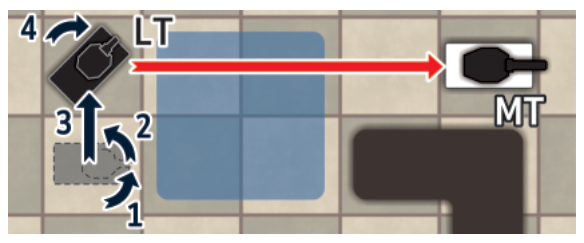

При желании игрок может умышленно завести любой свой танк в воду и утопить его
(фигура снимается с доски).

### Живые изгороди

**Живые изгороди** (изображают высокие кусты, чащу) обладают свойствами,
противоположными низким препятствиям. Проехать сквозь изгородь могут **все**
машины, но **стрелять сквозь неё не может никто**: она перекрывает обзор, если
изгородь стоит хотя бы на одной из клеток между стрелком и целью. Однако миномёты
и гаубицы стреляют поверх изгородей как обычно. Уничтожить изгородь нельзя (после
проезда танка она распрямляется).

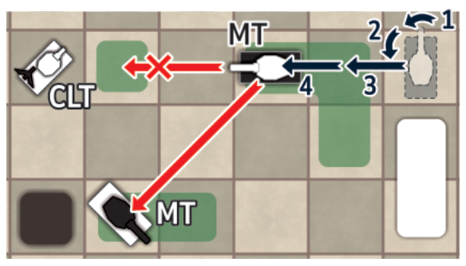

На схеме выше чёрный средний танк может стрелять по белому MT, но не может — по
белому CLT, потому что на линии огня стоит изгородь.

### Грязь

**Грязевые препятствия** никак не влияют на стрельбу, но **замедляют движение**.
Когда фигура доезжает до клетки с грязью, она немедленно останавливается. Более
того, если фигура **начинает** ход на клетке с грязью, она может сделать только
**один шаг** (на одну клетку вперёд, назад или один поворот на 45°).

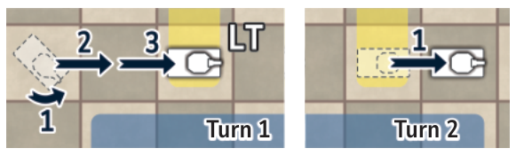

### Деревья

**Деревья** — препятствия, которые нельзя ни проехать, ни прострелить. Однако
сверхтяжёлый танк (ST), тяжёлый танк (HT) и тяжёлый бульдозер (HB) могут валить
деревья. Когда дерево уничтожено (зелёный маркер снимается с доски), сваливший
его танк **не может двигаться дальше в этом же ходу** (он останавливается на
клетке, где было дерево), но стрелять всё ещё может. Следующим ходом танк
двигается как обычно.

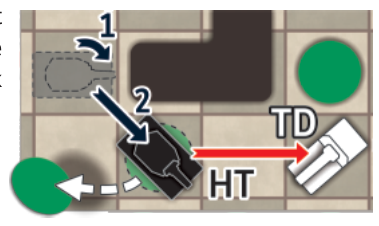

### Наземные мины

**Наземные мины** обозначены красными шестиугольными маркерами. Пересечь мину
может только минный тральщик (MS) — он её при этом обезвреживает. Любая другая
машина уничтожается, если приходит на клетку с красным маркером. **Стрелять поверх
мин можно.**

В большинстве случаев нет смысла умышленно уничтожать свой танк, наезжая на мину,
но в отдельных ситуациях уничтоженный танк может прикрыть другие, более важные
машины — см. пример ниже:

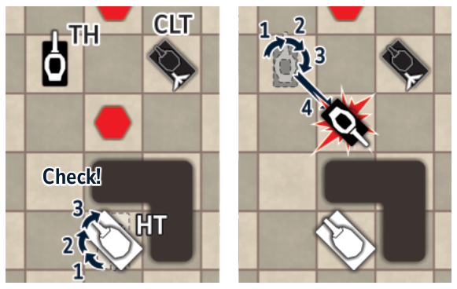

---

## Новые фигуры

Кроме боевых машин, Fun Set содержит фигуры с особыми ролями: разминирование,
расталкивание уничтоженных танков, преодоление воды и так далее. Характеристики
всех типов машин напечатаны на справочных листах и информационных карточках.

Ниже характеристики записаны как в оригинале: **броня — лоб–борт–корма**.

### Боевые машины

**Сверхтяжёлый танк** (ST) — самая крепкая броня (**IV**–**III**–**II**), очень
сильная пушка (**IV**), но крайне низкая скорость (**2**). Продвигается очень
медленно, но почти неуязвим.

**Истребитель** (Tank Hunter, TH) — слабая броня (**0**–**0**–**0**), зато очень
быстрый (**5**) и с приличной пушкой (**II**). Может быть очень эффективен в охоте
за командирским танком противника.

**Штурмовое орудие** (Assault Gun, AG) — приличная скорость (**4**), мощная пушка
(**III**) и крепкая лобовая броня (**III**–**0**–**0**). Вращающейся башни нет,
поэтому стреляет только прямо вперёд.

**Разведывательный танк** (Recon Tank, RT) — самая высокая скорость (**6**), но
слабая броня (**0**–**0**–**0**) и пушка (**I**). Очень полезен в роли
командирского танка или в погоне за командирским танком противника.

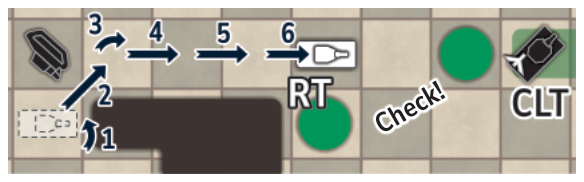

**Танк с двумя пушками** (Twin-gun Tank, TT) — броня (**II**–**I**–**0**) и
скорость (**4**) как у среднего танка, но у него две пушки. Главная имеет значение
**II** и стреляет только прямо вперёд, а вторая (**I**) стоит в малой башенке и
поэтому стреляет в трёх направлениях. Танк с двумя пушками может выстрелить по
**двум** целям в один ход.

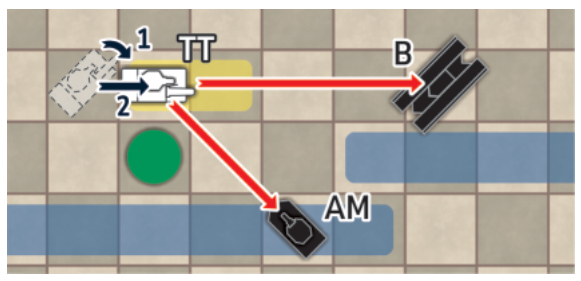

**Ракетная установка** (Rocket Launcher, RL) — полугусеничная машина, вооружённая
ракетами. Низкая скорость (**3**) и слабая броня (**0**–**0**–**0**). Может
запустить **две** ракеты (мощность **V**) одновременно и тем самым уничтожить две
машины противника за один ход. Ракеты пускает прямо вперёд и **может поражать цели
за препятствиями** на дистанции от **3** до **6** клеток.

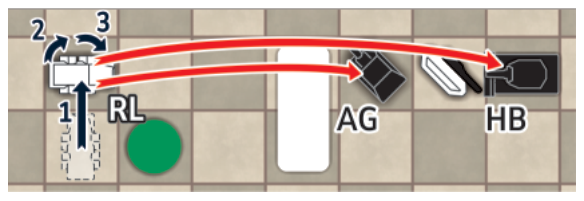

На схеме выше белая ракетная установка уничтожает две чёрные фигуры.

**Амфибия** (AM) — плохая броня (**0**–**0**–**0**) и скромная пушка (**I**), но
высокая максимальная скорость (**5**). Единственная машина, способная **проходить
по воде**.

Если амфибия уничтожена, находясь на воде, фигура снимается с доски (она тонет и
потому не становится препятствием).

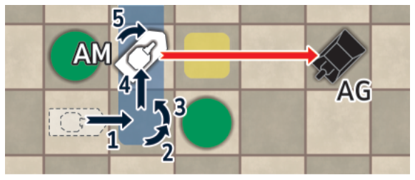

### Машины навесного огня

**Лёгкий миномёт** (Light Mortar, LM) стреляет поверх препятствий на короткой
дистанции — **2 или 3** клетки. Броня слабая (**I**–**0**–**0**), но скорость
приличная (**4**). В отличие от тяжёлого миномёта, у него слабая пушка (**II**).
Стреляет только прямо вперёд.

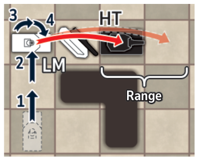

**Тяжёлая гаубица** (Heavy Howitzer, HH) — слабая броня (**I**–**I**–**0**) и низкая
скорость (**3**), зато мощная пушка (**IV**) и стрельба поверх препятствий на
большую дистанцию (**от 5 до 9** клеток), так что она поддерживает огнём из
глубины.

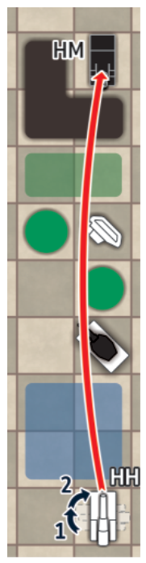

**Лёгкая гаубица** (Light Howitzer, LH) стреляет поверх препятствий, только прямо
вперёд, на дистанции от **4** до **7** клеток. Хорошая скорость (**4**) и огневая
мощь (**III**), но слабая броня (**0**–**0**–**0**).

### Машины особых ролей

**Минный тральщик** (Minesweeper, MS) — средний танк с минным трал-бойком,
уничтожающим наземные мины простым проездом по ним. Маркеры уничтоженных мин
снимаются с доски. За один ход MS может протралить сразу несколько клеток с
минами. Скорость (**4**) и пушка (**II**) как у среднего танка, но бортовая броня
слабее (**II**–**0**–**0**) — плата за вес трала.

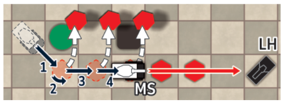

На схеме выше белый минный тральщик снял по пути три мины и стреляет по чёрной
лёгкой гаубице.

**Тяжёлый бульдозер** (Heavy Bulldozer, HB) оснащён отвалом для расталкивания
уничтоженных танков. Толкать может все типы машин, кроме сверхтяжёлого танка. За
раз толкает только **один** уничтоженный танк и только **прямо вперёд**. Если
толкаемый танк попадает в воду, фигура снимается с доски (тонет). У бульдозера
пушка (**III**) и скорость (**3**) как у тяжёлого танка, но кормовая броня слабее —
плата за вес отвала (**III**–**II**–**0**).

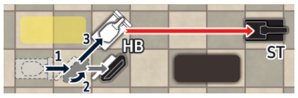

На схеме выше белый тяжёлый бульдозер первым шагом столкнул уничтоженный танк,
затем повернулся на месте и третьим шагом поехал прямо вперёд. С этой позиции он
стреляет по чёрному сверхтяжёлому танку.

**Ремонтная машина** (Recovery Vehicle, R) в бою не участвует, зато умеет
**восстанавливать уничтоженные танки**. Порядок ремонта такой:

1. Первым ходом R занимает позицию так, чтобы уничтоженный танк оказался **прямо
   перед ней**.
2. Одним из следующих ходов (не обязательно ближайшим) танк ремонтируется — фигура
   ставится обратно на колёса. В этот ход **ни одна машина не может ни двигаться,
   ни стрелять** (весь ход «уходит» на ремонт).
3. Со следующего хода отремонтированный танк снова может участвовать в бою.

У ремонтной машины приличная скорость (**4**) и слабая броня (**I**–**I**–**0**).

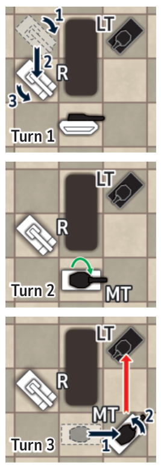

*Необязательное правило: разрешается ремонтировать танки противника. В этом случае
отремонтированный танк считается захваченным и продолжает бой на другой стороне (к
фигуре крепится флажок противоположного цвета).*

**Мостовой танк** (Bridge Tank, B) пушки не имеет и потому воевать не может. Его
роль — обеспечивающая: он даёт другим танкам способ преодолеть воду. Мост
разворачивается, когда танк выходит на клетку с водным препятствием: фигура
разделяется на две части — нижняя (корпус) снимается с доски, а верхняя (мост)
кладётся на эту клетку.

С этого момента моста могут пользоваться **все** фигуры, включая фигуры противника.
Для этого машина должна подходить к мосту **по прямой** и не может поворачиваться
на месте, пока стоит на мосту (двигаться разрешено только вперёд или назад). Не
может пересечь мост только сверхтяжёлый танк *(и ультратяжёлый танк из дополнения
«Special Pieces»)*.

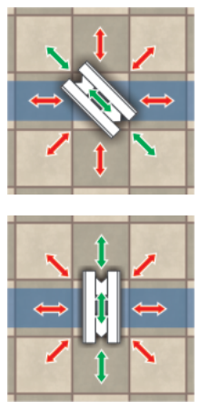

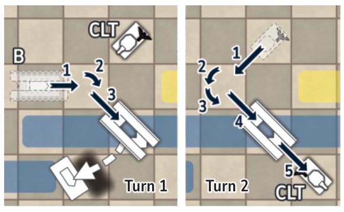

У мостового танка приличная скорость (**4**) и одинаковая броня со всех сторон
(**I**–**I**–**I**). Развёрнутый мост уничтожить нельзя.

Если на мосту в данный момент нет машин, мостовой танк может **выйти из воды**
(корпус снова прикрепляется к мостовой части), сделав один шаг вперёд или назад
(поворачиваться на месте, находясь в воде, он не может). Следующим ходом он
двигается по земле как обычно и может развернуть мост в другом месте. Пока он вне
воды, его можно уничтожить.

---

## Радиоуправляемые мины

РУ-мины маркерами не обозначаются. Вместо этого у каждого игрока есть блокнот, где
он записывает координаты **3 клеток на своей половине доски**, и прячет запись от
противника.

Когда танк противника проходит через записанную клетку (на любом шаге своего
перемещения), игрок **может** активировать мину. Если он так решает, координаты
надо показать противнику (только по активированной мине). Уничтоженная фигура затем
кладётся на бок и остаётся на этой клетке.

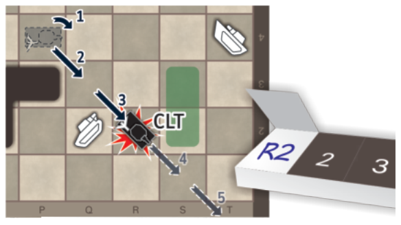

Однако если игрок не хочет активировать мину, показывать координаты из блокнота он
не обязан. Такое решение логично, если он ждёт более ценную фигуру противника.

---

## Расстановки доски

В брошюре приведены восемь разных расстановок доски, каждая в двух вариантах — для
досок 16×16 и 20×20 клеток. Используются все типы препятствий из базовой игры и из
этого дополнения.

Так на схемах в брошюре обозначаются разные типы препятствий:

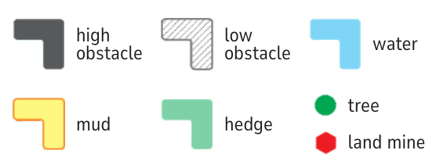

| Обозначение | Препятствие |
|---|---|
| тёмно-серое | высокое препятствие |
| штриховка | низкое препятствие |
| голубое | вода |
| жёлтое | грязь |
| зелёное | живая изгородь |
| зелёный круг | дерево |
| красный шестиугольник | наземная мина |

---

## Сводка новых машин

Значения собраны из текста рулбука; броня записана как **лоб–борт–корма**. Прочерк
означает, что в тексте характеристика не названа.

| Машина | Код | Скорость | Огневая мощь | Броня | Особенности |
|---|---|---|---|---|---|
| Сверхтяжёлый танк | ST | 2 | IV | IV–III–II | валит деревья; не проходит по мосту |
| Истребитель | TH | 5 | II | 0–0–0 | охота за командирским танком |
| Штурмовое орудие | AG | 4 | III | III–0–0 | без башни, огонь только вперёд |
| Разведывательный танк | RT | 6 | I | 0–0–0 | самый быстрый |
| Двухпушечный танк | TT | 4 | II (вперёд) + I (башенка) | II–I–0 | две цели за ход |
| Ракетная установка | RL | 3 | V ×2 | 0–0–0 | навесом 3–6 клеток, две цели за ход |
| Амфибия | AM | 5 | I | 0–0–0 | проходит по воде; утонув, снимается с доски |
| Лёгкий миномёт | LM | 4 | II | I–0–0 | навесом 2–3 клетки, только вперёд |
| Тяжёлая гаубица | HH | 3 | IV | I–I–0 | навесом 5–9 клеток |
| Лёгкая гаубица | LH | 4 | III | 0–0–0 | навесом 4–7 клеток, только вперёд |
| Минный тральщик | MS | 4 | II | II–0–0 | снимает мины проездом |
| Тяжёлый бульдозер | HB | 3 | III | III–II–0 | толкает обломки; валит деревья |
| Ремонтная машина | R | 4 | — (не воюет) | I–I–0 | восстанавливает уничтоженные танки |
| Мостовой танк | B | 4 | — (нет пушки) | I–I–I | разворачивает мост через воду |

Для сравнения — машины базового набора: LT 5/I/I–0–0, MT 4/II/II–I–0, HT 3/III/III–II–I,
TD 4/IV/II–I–0, HM 3/V/I–0–0 (см. [rulebook.md](rulebook.md)).
