# Tank Chess — правила настольной игры

Перевод официального рулбука (`RuleBook.pdf`, 8 страниц). Иллюстрации вырезаны
из исходного PDF и лежат в [img/](img/). Авторы игры: Драган Лазович и Предраг
Лазович.

Правила дополнений:

- [rulebook-fun-set.md](rulebook-fun-set.md) — Fun Set: 6 новых препятствий и 14
  типов машин
- [rulebook-fun-set-plus.md](rulebook-fun-set-plus.md) — Fun Set Plus: 8 новых
  препятствий и 15 типов фигур

- [Состав игры](#состав-игры)
- [Базовые правила](#базовые-правила)
  - [Скорость](#скорость)
  - [Вооружение](#вооружение)
  - [Броня](#броня)
  - [Цель игры](#цель-игры)
- [Объявление «шаха» и «побега»](#объявление-шаха-и-побега)
- [Запись партий](#запись-партий)
- [Разные расстановки доски](#разные-расстановки-доски)
- [Альтернативные режимы](#альтернативные-режимы)
- [Дополнения](#дополнения)

---

## Состав игры

- Две доски (16×16 клеток и 20×20 клеток)
- Набор сборных препятствий и краевых накладок
- 16 белых и 16 чёрных фигур (танков)
- Набор антенн и флажков
- Два справочных листа с характеристиками танков
- 10 информационных карточек
- Счётчик ходов и блокнот
- Рулбук и брошюра

У каждой **доски** одна сторона с напечатанными **препятствиями** (тёмные пятна,
закрывающие часть клеток) и с метками начальных позиций для разных типов фигур —
это называется **базовой расстановкой**.

**Сборные препятствия** ставятся на пустую сторону любой доски: либо по схемам из
брошюры, либо по своей задумке *(новые схемы можно зарисовать на пустых бланках
в брошюре)*. Размер доски уменьшается краевыми накладками *(например, 16×16
сводится к 12×12, а 20×20 — к 20×16)*.

**Фигуры** изображают танки (боевые машины) разных категорий. Их обозначения:

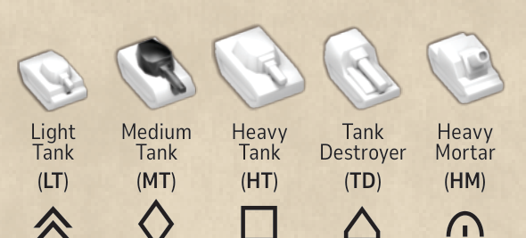

| Аббревиатура | Тип | По-русски |
|---|---|---|
| LT | Light Tank | лёгкий танк |
| MT | Medium Tank | средний танк |
| HT | Heavy Tank | тяжёлый танк |
| TD | Tank Destroyer | истребитель танков (ПТ-САУ) |
| HM | Heavy Mortar | тяжёлый миномёт |

В наборе есть пара чёрных и белых **антенн** и **флажков**. Антенны помечают
командирские танки, флажки нужны в некоторых особых режимах.

Все характеристики фигур (скорость, броня и вооружение) напечатаны на
**справочных листах** и **информационных карточках**.

**Счётчик ходов** и **блокнот** для игры не обязательны, но пригодятся, чтобы
считать сделанные ходы и записывать партии.

**Брошюра** содержит схемы альтернативных расстановок доски и пустые бланки для
рисования собственных схем препятствий.

---

## Базовые правила

Первые несколько партий лучше играть на доске 16×16 с базовой расстановкой
препятствий.

Перед началом игры фигуры ставятся на свои метки на доске, лицом к
противоположной стороне доски.

Одна фигура каждого цвета — **командирский танк**, помеченный антенной
противоположного цвета. К аббревиатуре добавляется буква `C`. В большинстве
расстановок командирский — лёгкий танк (**CLT**).

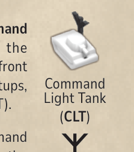

Если командирским назначен другой тип фигуры, его аббревиатура напечатана рядом
с меткой на доске (например, `CMT`).

Первым играет игрок белыми. За ход перемещается **одна** фигура, игроки ходят по
очереди. После перемещения стрелять по фигуре противника может **только та
фигура, которая ходила** (если она оказалась в подходящей позиции).

Три базовые характеристики каждой машины: **скорость**, **вооружение** и
**броня**.

### Скорость

Фигуры могут ехать прямо вперёд, поворачиваться на месте на 45° или сочетать то
и другое. Каждый поворот на 45° и каждое перемещение на соседнюю клетку считается
одним **шагом**.

Скорость задаёт максимальное число шагов за один ход:

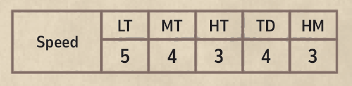

| Скорость | LT | MT | HT | TD | HM |
|---|---|---|---|---|---|
| шагов за ход | 5 | 4 | 3 | 4 | 3 |

Любая фигура может ехать задним ходом, но только на одну клетку и **без**
сочетания с поворотом.

Двигаться можно только по пустым клеткам — никогда сквозь препятствия или другие
фигуры. Кроме того, поворот фигуры влево, а затем вправо, возвращающий её в ту же
позицию и в то же направление, **не** считается перемещением. Примеры:

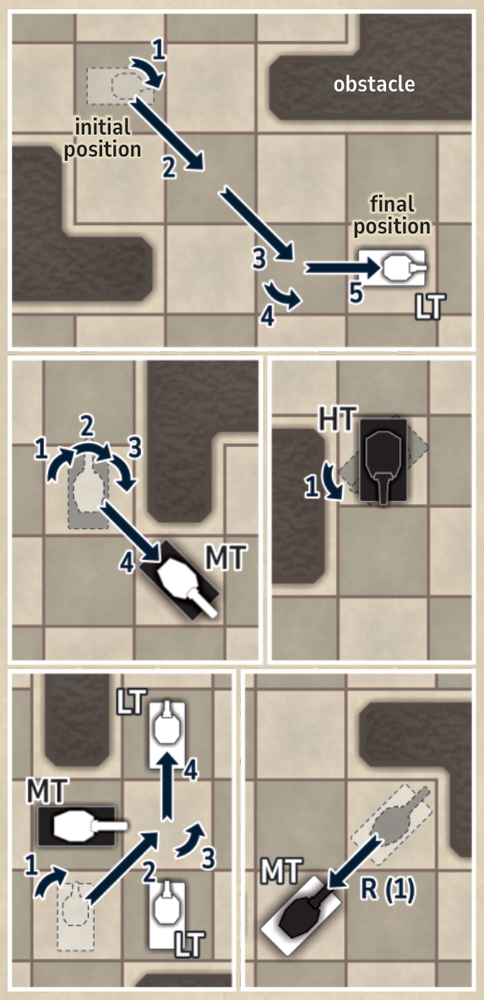

### Вооружение

У каждой категории машин своя огневая мощь:

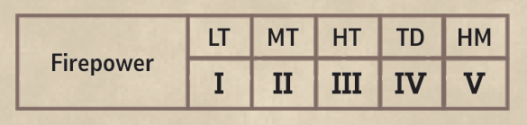

| Огневая мощь | LT | MT | HT | TD | HM |
|---|---|---|---|---|---|
| значение | I | II | III | IV | V |

В зависимости от типа вооружения часть фигур стреляет **прямой наводкой**
(пушки), а часть — **по навесной траектории** (гаубицы и миномёты).

#### Пушка

У танков есть башня, поэтому они стреляют в трёх направлениях: прямо вперёд, по
диагонали влево или по диагонали вправо.

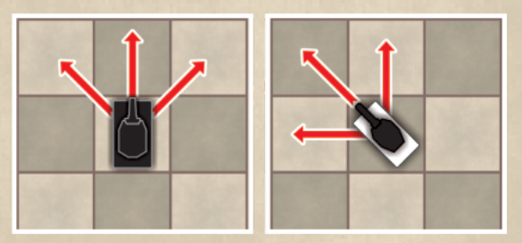

У истребителя танков башни нет, поэтому он стреляет только прямо вперёд.

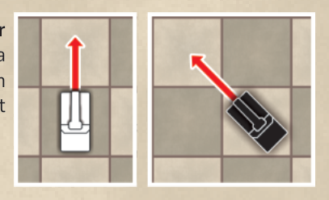

При стрельбе из пушки между стрелком и целью должна быть **непрерывная прямая
линия видимости** (без других фигур и препятствий на пути).

Дальность пушек не ограничена, но между стреляющей фигурой и целью должна быть
**хотя бы одна пустая клетка**. Примеры:

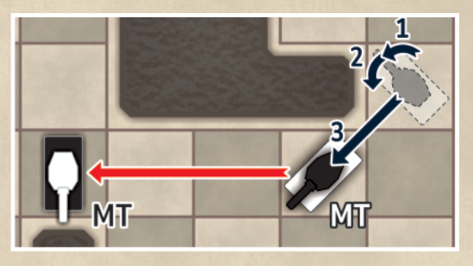

На схеме выше белый средний танк выходит на позицию для стрельбы по танку
противника.

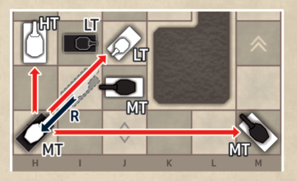

На схеме выше чёрный средний танк идёт задним ходом и оказывается в позиции для
стрельбы по трём белым танкам. Игрок обязан выбрать только одну цель.

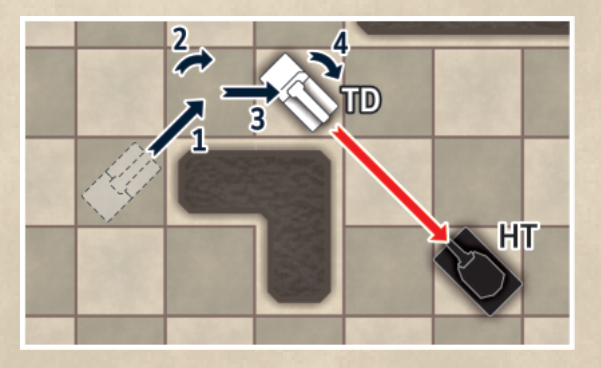

На схеме выше белый истребитель танков выходит на позицию для стрельбы по чёрному
тяжёлому танку.

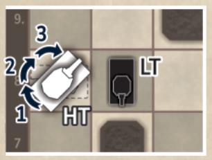

На схеме слева белый тяжёлый танк **не может** стрелять по чёрному лёгкому танку,
потому что между ними нет пустых клеток.

#### Гаубица / миномёт

Главная особенность гаубиц и миномётов — возможность стрелять по целям **за
препятствиями или другими машинами**. В этом наборе такое вооружение есть только
у тяжёлого миномёта.

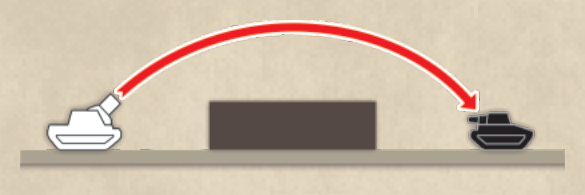

Тяжёлый миномёт стреляет только прямо вперёд.

У гаубиц и миномётов ограничены и минимальная, и максимальная дальность. Тяжёлый
миномёт бьёт по целям на дистанции **3, 4 или 5** клеток.

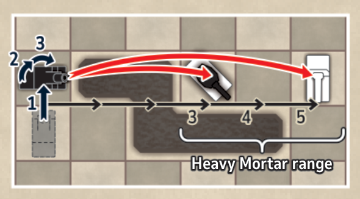

В примере выше чёрный тяжёлый миномёт выходит на позицию, откуда может выстрелить
либо по белому среднему танку (дистанция 3 клетки), либо по истребителю танков
(5 клеток). Уничтожить он может только одну цель.

### Броня

У танков и других машин разное значение брони с каждой стороны. У большинства
машин броня сильнее всего в лоб, слабее в борт и слабее всего в корму:

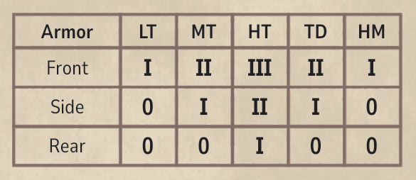

| Броня | LT | MT | HT | TD | HM |
|---|---|---|---|---|---|
| лоб | I | II | III | II | I |
| борт | 0 | I | II | I | 0 |
| корма | 0 | 0 | I | 0 | 0 |

Лобовая броня поражается только если стреляющая машина стоит **прямо перед**
целью (чёрная стрелка). Так же и кормовая — только если **прямо позади** цели
(белая стрелка). Бортовая броня поражается с любого другого направления (серые
стрелки).

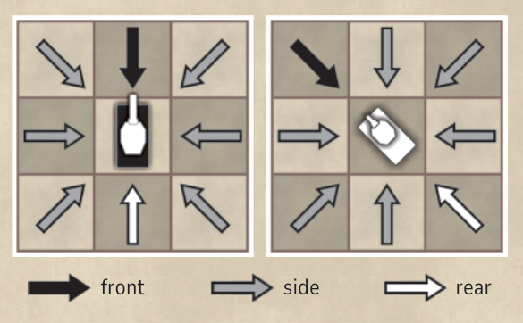

Чтобы уничтожить фигуру противника, огневая мощь стреляющего должна быть **строго
больше** значения брони цели (лобовой, бортовой или кормовой). *Если броня равна
`0`, эта сторона танка не даёт никакой защиты от танков противника.*

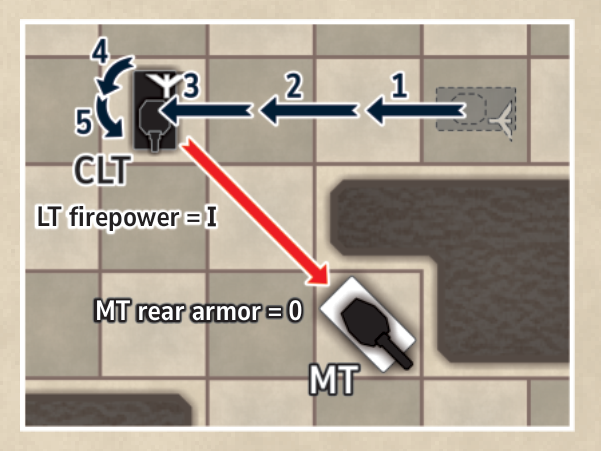

На схеме выше чёрный командирский танк (CLT) уничтожает белый средний танк
попаданием в корму: огневая мощь LT = **I** больше кормовой брони MT = **0**.

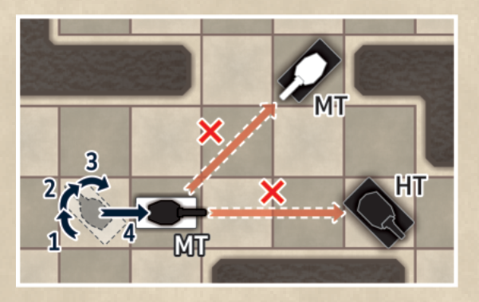

На схеме выше белый средний танк выходит на позицию для стрельбы по двум чёрным
танкам, но не может уничтожить ни один из них: его огневая мощь (**II**) не
превосходит значений брони чёрных танков (лобовая броня MT = **II**, бортовая
броня HT = **II**).

Уничтоженная фигура **кладётся на бок и остаётся на своей клетке**. Уничтоженные
танки становятся препятствиями, через которые нельзя ни стрелять, ни ехать.

### Цель игры

Победа достигается двумя способами:

1. Уничтожить командирский танк противника.
2. Сбежать своим командирским танком, выведя его с доски через край,
   противоположный начальной позиции.

Побеждает тот, кто первым добился любой из двух целей.

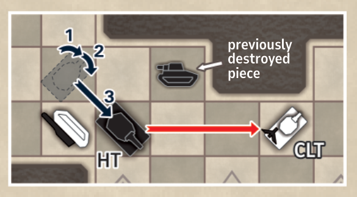

В примере выше чёрный тяжёлый танк выходит на позицию и уничтожает белый
командирский танк. Игра окончена, победил чёрный.

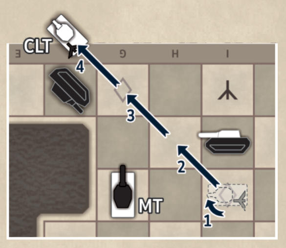

На схеме выше белый командирский танк покидает доску с противоположной стороны
(на четвёртом шаге перемещения). Игра окончена, победил белый.

Однако командирский танк **не может** выйти с доски по диагонали через её угол.

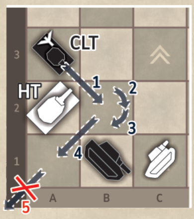

Именно поэтому на схеме слева чёрный командирский танк этим ходом с доски выйти
не может.

---

## Объявление «шаха» и «побега»

В Tank Chess можно играть по образцу классических шахмат, где финальный
выигрышный ход не делается. Вместо этого цель — поставить противнику «мат» или
«мат побегом»:

1. Если командирскому танку противника **угрожают** (позиция на доске такова, что
   следующим ходом его можно уничтожить), игрок обязан после своего хода объявить
   **ШАХ**. Так противник предупреждён и обязан сделать ход, спасающий свой
   командирский танк. Любой ход, который его не спасает, запрещён (если он сделан
   ошибочно, ход просто отменяется). Если противник не в состоянии предотвратить
   уничтожение своего командирского танка — это **МАТ** и победа.

   Угроза командирскому танку бывает прямой — фигура становится в позицию, из
   которой следующим ходом сможет выйти на линию огня, — или косвенной, когда
   ходом одной фигуры открывается путь другой, способной следующим ходом
   уничтожить командирский танк.

   Игроку также запрещён ход, позволяющий противнику уничтожить его командирский
   танк сразу же следующим ходом (например, поставить командирский танк на
   «опасную» клетку либо сдвинуть другую фигуру, открыв противнику линию огня или
   путь).

2. Так же и с побегом: если позиция на доске такова, что командирский танк
   следующим ходом сможет сбежать (выйти с доски через противоположный край),
   игрок обязан после своего хода объявить **ПОБЕГ**. Следующим ходом противник
   обязан побег предотвратить, и любой ход, который его не предотвращает,
   запрещён. Если противник не способен помешать побегу командирского танка — это
   **МАТ ПОБЕГОМ** и победа.

   Также запрещён любой ход, который позволил бы командирскому танку противника
   сбежать сразу следующим ходом (открыв ему путь).

Как вариант, можно играть вовсе без мата и без объявления шаха/побега — до
фактического уничтожения командирского танка или до его побега. Так игра
становится напряжённее: легко, например, неожиданно потерять командирский танк
из-за мелкой невнимательности, несмотря на лучшую позицию на доске. При игре с
шахматными часами характер партии меняется: быстрое распознавание линий огня
становится важнее стратегии.

### Замечания

- Ничьи крайне редки, а неожиданная победа из проигрышной позиции вполне
  возможна, если противник неосторожен.
- Все фигуры одинаково важны. На первый взгляд тяжёлые танки ценнее, но в
  эндшпиле скорость лёгких танков полезнее сильной брони и огневой мощи.
- Тяжёлые миномёты существенно влияют на игру, поскольку убирают «безопасные»
  клетки за препятствиями.
- Соотношение препятствий и пустых клеток в базовых расстановках сбалансировано:
  есть открытые направления для стрельбы на большую дистанцию, но и достаточно
  укрытий. Схемы из брошюры дают разные условия, вплоть до крайностей — «Open
  Field» (мало препятствий) и «Old Town» (много препятствий).
- Можно играть с шахматными часами. Рекомендуемое время для доски 16×16 — 30
  минут на игрока, для 20×20 — по 45 минут.

---

## Запись партий

Буквы и цифры по краям доски задают координаты каждой клетки (например, `F11`).
В центре доски нарисован компас, помогающий определить стороны света: N, E, W и
S. По координатам и ориентации фигур можно записать всю партию. Перед началом
игры запишите размер доски и использованную схему препятствий. Ниже разобран
один полный ход:

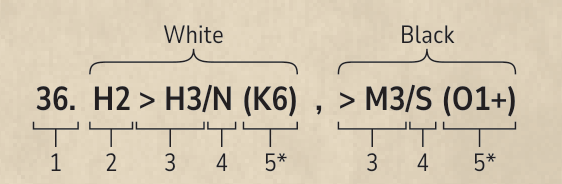

```
36.  H2 > H3/N (K6)  ,  > M3/S (O1+)
 1    2     3  4  5*      3   4  5*
```

1. Номер хода.
2. Начальные координаты сдвинутой фигуры (опускаются, если фигура только
   поворачивалась на месте).
3. Конечные координаты сдвинутой фигуры.
4. Ориентация фигуры в конечной позиции.
5. В скобках — координаты уничтоженной фигуры противника и/или один из символов:

| Символ | Значение |
|---|---|
| `+` | **шах** — командирский танк противника может быть уничтожен следующим ходом |
| `#` | **мат** — командирский танк противника будет уничтожен следующим ходом, это конец игры |
| `−` | **побег** — свой командирский танк в позиции для выхода с доски следующим ходом |
| `=` | **мат побегом** — свой командирский танк наверняка выйдет с доски следующим ходом, это конец игры |

*Пункт 5 указывается только если фигура была уничтожена или наступило одно из
описанных условий.*

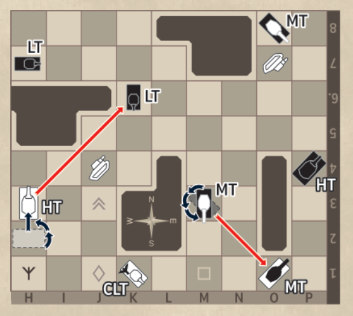

Схема выше показывает 36-й ход целиком. Предыдущим, 35-м ходом чёрные вывели
лёгкий танк на клетку `K6` и оказались в позиции, из которой следующим ходом
уничтожат белый CLT (переставив LT на клетку `I3`). Значит, это шах. Для защиты
белые могут либо отвести CLT на безопасную клетку, либо уничтожить чёрный LT. Они
выбирают второе: ставят HT на клетку `H3` и уничтожают чёрный LT на `K6`.

Тем же ходом чёрные поворачивают свой MT на клетке `M3` и уничтожают белый MT на
клетке `O1`, снова объявляя шах белому CLT (следующим ходом они смогут занять
позицию `M1/SW` и уничтожить командирский танк).

37-й ход показан на схеме ниже.

```
37.  K1 > N3/NE  ,  H7 > K7/SE (#)
```

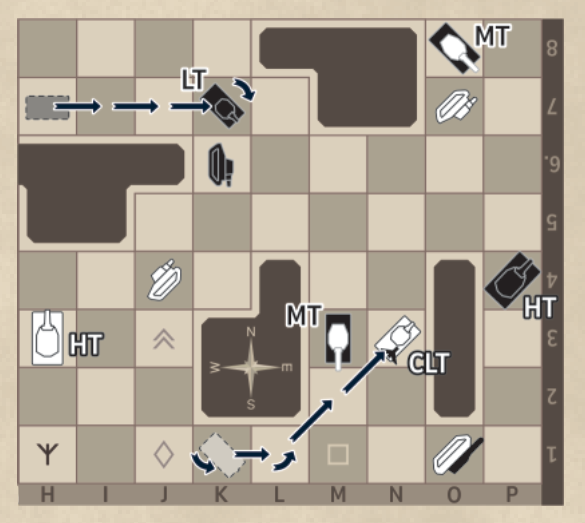

Чтобы защитить командирский танк, белые отводят его на клетку `N3`. Ход, однако,
плохой: чёрные переставляют LT с `H7` на `K7` и снова объявляют шах белому CLT.
Внимательно разобрав позицию, приходим к выводу, что это мат и победа чёрных! Для
белого CLT нет ни одной клетки, которая не простреливалась бы LT (`K7`), MT
(`M3`), HT (`P4`) или MT (`O8`). Уничтожить чёрную фигуру, угрожающую CLT, белые
тоже никак не могут (как в предыдущем ходу), и прикрыть CLT другой белой фигурой
нельзя.

---

## Разные расстановки доски

Как уже сказано во введении, сборные препятствия можно разложить на пустой
стороне любой доски множеством способов.

Схемы некоторых возможных расстановок приведены в брошюре. Начальные позиции
фигур помечены соответствующими символами.

Чтобы разнообразить партии, игроки могут договориться играть со **свободным
выбором фигур**, не по схемам. Общее число фигур и начальные позиции при этом
сохраняются, но тип фигуры и символ на метке совпадать не обязаны.

### Правила составления расстановок

Свои схемы препятствий можно зарисовать на пустых бланках в брошюре, соблюдая
следующие принципы:

- Начальные позиции белых фигур — на южной стороне доски, чёрных — на северной.
- Желательно, чтобы препятствия и начальные позиции стояли симметрично
  (предпочтительно центральная симметрия).
- Препятствия и начальные позиции нельзя расставлять так, чтобы уничтожение
  фигуры противника стало возможно уже первым ходом.

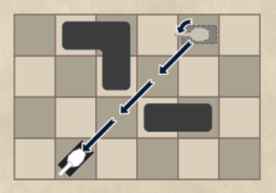

Замечание: если препятствия поставлены как на схеме справа, фигуры могут
проехать между ними.

Краевые накладки нужны прежде всего для уменьшения числа клеток на доске —
например, с 16×16 до 12×12 или с 20×20 до 20×16 *(число клеток по горизонтали и
вертикали не обязано совпадать)*. Но их же можно использовать и как крупные
препятствия, например:

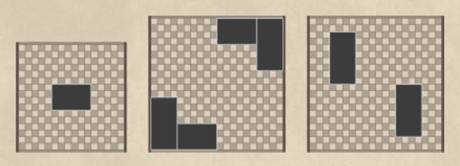

---

## Альтернативные режимы

Базовые правила очень просты и дают бесконечно много уникальных партий. Кроме
размера и конфигурации доски или числа и выбора фигур, менять можно и саму цель
игры — в альтернативных режимах.

### Фигуры одного типа

Все фигуры могут представлять одну категорию машин (например, все танки получают
свойства средних танков), независимо от того, какая фигура стоит на доске. Одна
фигура должна быть командирским танком (помечена антенной).

Если все фигуры — танки одной категории (лёгкие, средние или тяжёлые), то ни один
танк нельзя уничтожить в лоб. Самые динамичные партии — когда все фигуры лёгкие
танки.

Если все фигуры — истребители танков или тяжёлые миномёты, броня перестаёт
что-либо значить: любую фигуру можно уничтожить с любой стороны, поэтому
стратегию надо менять радикально.

Этот режим применим почти к любой расстановке препятствий.

### Последний выживший (Last Tank Standing)

Играется на любых расстановках препятствий. Цель — уничтожить все машины
противника. Командирского танка в этом режиме нет, победа побегом невозможна.

В отличие от базовых правил, партия легко может закончиться ничьёй *(например,
если у одного игрока остался тяжёлый танк, а у другого — лёгкий: LT не может
уничтожить HT, а HT никогда не догонит LT, чтобы по нему выстрелить)*. Поэтому
игру можно ограничить числом ходов, например 25 (по счётчику ходов), после чего
считается число выживших машин.

Режим особенно подходит для младших игроков.

### Побег трёх танков

Как и в предыдущем режиме, командирского танка нет и подходит любая расстановка
препятствий. Цель каждого игрока — прорвать линию противника и вывести с доски
через противоположный край **любые три** машины. Побеждает тот, кто сделал это
первым.

Стоит учесть, что спешить с побегом первых двух танков — не лучшая стратегия,
потому что в бою остаётся меньше сил. Если ни один игрок не сумел вывести три
танка, побеждает тот, кто вывел больше; возможна и ничья.

### Захват флага

Играется на доске любого размера и на любой схеме препятствий, у которой четыре
центральные клетки свободны (без препятствий). Один флаг ставится точно в
середину доски. Цель — добраться до флага, взять его и донести до любой клетки на
своём стартовом краю доски.

Когда фигура приходит на одну из четырёх центральных клеток, она может взять
флаг; если игрок так решает, флаг крепится к фигуре. Фигура, ходившая ради
взятия флага, в этом же ходу стрелять не может.

Если фигура с флагом уничтожена, флаг может взять фигура любой из сторон. Чтобы
забрать флаг у уничтоженного танка, фигура должна закончить перемещение на
соседней клетке. По тем же правилам флаг можно забрать и у своей фигуры: держащая
флаг фигура должна стоять на месте, а забирающая — прийти на соседнюю клетку к
концу хода. Сколько танков за партию поносят флаг — не ограничено.

Как вариант режима, флагов может быть нечётное число (например, три), и
побеждает тот, кто захватил больше.

### Четыре игрока

Поскольку игрокам приходится делить цвет фигур, двое крепят к своим танкам
флажки; команды получаются такие: белые, белые с флажком, чёрные, чёрные с
флажком. Командирские танки помечены антенной (белые и чёрные) либо флажком
другой формы (команды с флажками).

Начальные позиции и порядок ходов показаны в брошюре, в схемах «Corner» и «Four
the Glory».

Каждый играет против всех, задача — уничтожить как можно больше танков (победа
побегом невозможна).

Игра заканчивается, когда трое из четырёх игроков потеряли все свои танки, либо
когда уничтожить больше нечего — например, часть фигур заперта за уничтоженными
танками. Каждый считает очки: 1 за каждую свою выжившую фигуру и 1 за каждую
уничтоженную им фигуру противника (кто-то из игроков должен вести счёт и
записывать его по ходу партии). Командирские танки уничтожаются как любые другие,
только стоят 2 очка каждый. Побеждает набравший больше всех очков *(может
оказаться, что единственный игрок с фигурами на доске не победил, если уничтожил
мало фигур противника)*.

Вместо игры до последнего оставшегося партию можно ограничить условленным числом
ходов (например, считать очки после того, как каждый сделал 15 ходов).

---

## Дополнения

Тем, кому нужно больше разнообразия, у Tank Chess есть несколько дополнений: Fun
Set, Fun Set Plus и Airborne. Они добавляют новые типы препятствий (вода, живые
изгороди, огонь, грязь, дым и прочее), а также новые машины (сверхтяжёлый танк,
амфибия, лёгкая и тяжёлая гаубица, огнемёт, минный заградитель, зенитный танк и
так далее).

Правила Fun Set и Fun Set Plus переведены отдельно —
[rulebook-fun-set.md](rulebook-fun-set.md) и
[rulebook-fun-set-plus.md](rulebook-fun-set-plus.md).

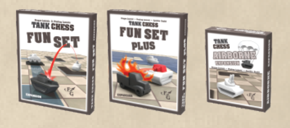

---

*Авторы игры: Драган Лазович и Предраг Лазович.*
